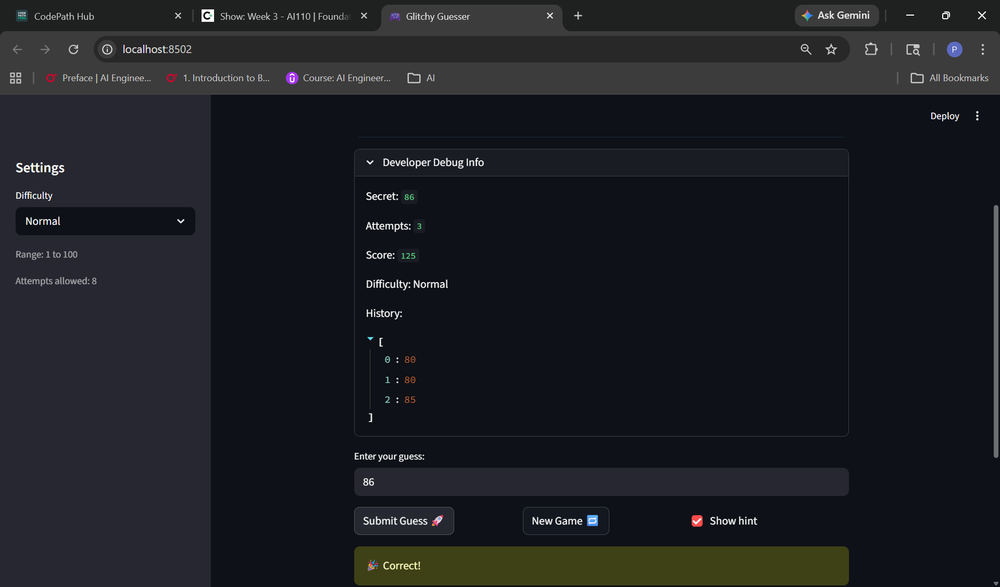

# 🎮 Game Glitch Investigator: The Impossible Guesser

## 🚨 The Situation

You asked an AI to build a simple "Number Guessing Game" using Streamlit.
It wrote the code, ran away, and now the game is unplayable. 

- You can't win.
- The hints lie to you.
- The secret number seems to have commitment issues.

## 🛠️ Setup

1. Install dependencies: `pip install -r requirements.txt`
2. Run the broken app: `python -m streamlit run app.py`

## 🕵️‍♂️ Your Mission

1. **Play the game.** Open the "Developer Debug Info" tab in the app to see the secret number. Try to win.
2. **Find the State Bug.** Why does the secret number change every time you click "Submit"? Ask ChatGPT: *"How do I keep a variable from resetting in Streamlit when I click a button?"*
3. **Fix the Logic.** The hints ("Higher/Lower") are wrong. Fix them.
4. **Refactor & Test.** - Move the logic into `logic_utils.py`.
   - Run `pytest` in your terminal.
   - Keep fixing until all tests pass!

## 📝 Document Your Experience

- [ ] Describe the game's purpose.
My game purpose is to make the user happy when they guessed the secret number. So, my game generates a secret number based on the difficulty level chosen by the user and the user has to guess the secret number in the given no.of tries and also the hints provided. If the user guesses the number correctly, the ballons will pop up on the screen congratulating, or if the user fails to guess in the given no.of tries, the game will end. It has to generate the secret number based on the difficulty level selected and it also have to start a new game( with previous scores included i.e., if there are any previous scores of the user in that session)
- [ ] Detail which bugs you found.
I have found some bugs when i first opened the game.
1) The hints displayed are wrong
2) The secret number id not chosen according to the difficulty selected
3) Secret number kept changing intially
4) The next button is not working properly.
- [ ] Explain what fixes you applied.
1) For the hints display bug, I updated the code so that of the guess is less than secret, it should display "Go Higher" otherwise "Go Lower".
2) Intially, the code is written in such a way that the secret number is chosen between 1 and 100 randomly , irrespective of difficulty. I changed it in such a way it will be generated by getting the range(low & high values) based on the difficulty chosen by the user.
3) For the new_game bug, initially the button is not workin. I had modified and written some new code with the help of AI so that the button works and creates a new game. It also stores the previous games score of the user in that particular session.
4) Initially the secret kept changing because in streamlit, every interaction we do with the app re-runs the entire script. So, I have modified the code such that the secret is generated only if the secret in the current session is None or whenever the user chnages difficulty or wants to play a new game. This way the secret is not generated every time and stays persistent.
## 📸 Demo

- [ ] [Insert a screenshot of your fixed, winning game here]

## 🚀 Stretch Features

- [ ] [If you choose to complete Challenge 4, insert a screenshot of your Enhanced Game UI here]
